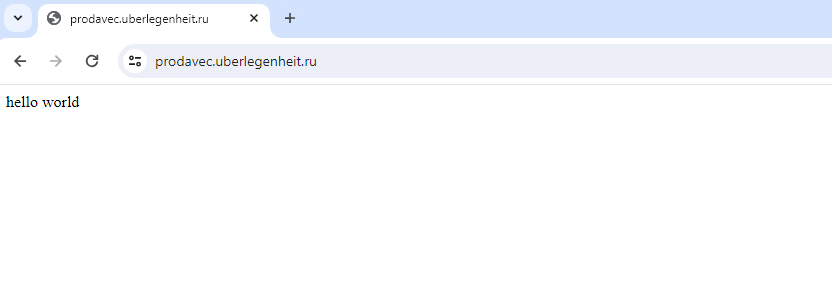

# Nginx + SSL configure virtualhost

### 1.Зашёл на машину, прокинул туда свой другой ключ ed25519:

`` ssh-ed25519 AAAAC3NzaC1lZDI1NTE5AAAAIEYOk/yxqlYln4pGaEoRugZ+baTnquUx0Ae5a5ROFDub vladi@DESKTOP-3GC0E3L ``
### 2. Cделал apt update, затем установил установил nginx,certbot произведя:

```
apt install nginx -y

apt install certbot -y

apt install python3-certbot-nginx 
```
### Далее удалил дефолтный файлик (default) с виртуальным хостом и заменил своим:

```
root@prodavec:/etc/nginx/sites-available# cat prodavec
server {
    listen 80;
    server_name prodavec.uberlegenheit.ru;

    return 301 https://host$request_uri;

   }

server {
    listen 443 ssl;
    server_name prodavec.uberlegenheit.ru www.prodavec.uberlegenheit.ru;

    ssl_certificate /etc/letsencrypt/live/prodavec.uberlegenheit.ru/fullchain.pem;
    ssl_certificate_key /etc/letsencrypt/live/prodavec.uberlegenheit.ru/privkey.pem;

    root /var/www/html;
    index index.html index.htm index.nginx-debian.html;
    access_log /var/log/nginx/access.log myformat;


    location / {
        try_files $uri $uri/ =404;

   }

    error_page 404 403 401 400 /error.html;

    location = /error.html {
        internal;

   }
}
```

### 3. Подготовил 2 файлика (кишки сайта), 1 - обычная index.html с hello world, 2-й для ошибок с текстом - idite k adminy sait ymer:

```
root@prodavec:/var/www/html# ll
total 16
drwxr-xr-x 2 root root 4096 Mar  1 23:33 ./
drwxr-xr-x 3 root root 4096 Feb 20 18:36 ../
-rw-r--r-- 1 root root   26 Mar  1 23:33 error.html
-rw-r--r-- 1 root root   12 Mar  1 23:32 index.html
root@prodavec:/var/www/html# cat index.html
hello world
root@prodavec:/var/www/html# cat error.html
sait ymer, idite k adminy
root@prodavec:/var/www/html# pwd
/var/www/html
```
### 4. Выполнил curl -ILk 10.182.10.160 и curl без ключей:

```
root@prodavec:/var/www/html# curl -ILk 10.182.10.160
HTTP/1.1 301 Moved Permanently
Server: nginx/1.18.0 (Ubuntu)
Date: Sun, 03 Mar 2024 22:41:45 GMT
Content-Type: text/html
Content-Length: 178
Connection: keep-alive
Location: https://host/

curl: (6) Could not resolve host: host
```

```
root@prodavec:/var/www/html# curl 10.182.10.160
<html>
<head><title>301 Moved Permanently</title></head>
<body>
<center><h1>301 Moved Permanently</h1></center>
<hr><center>nginx/1.18.0 (Ubuntu)</center>
</body>
</html>
```
Не отображается hello world через консоль, т.к. идёт редирект на https (который уже определил в confige

### 5. Поддомен получен - prodavec.uberlegenheit.ru и описан в конфиге, всё работает

```
root@prodavec:/var/www/html# curl prodavec.uberlegenheit.ru
<html>
<head><title>301 Moved Permanently</title></head>
<body>
<center><h1>301 Moved Permanently</h1></center>
<hr><center>nginx/1.18.0 (Ubuntu)</center>
</body>
</html>
```
### 6. Директивы для доступа по https добавлены в конфиг virtual host'a:

```
server {
    listen 443 ssl;
    server_name prodavec.uberlegenheit.ru www.prodavec.uberlegenheit.ru;

    ssl_certificate /etc/letsencrypt/live/prodavec.uberlegenheit.ru/fullchain.pem;
    ssl_certificate_key /etc/letsencrypt/live/prodavec.uberlegenheit.ru/privkey.pem;
```
### 7. Получил сертификаты с помощью certbot --nginx -d prodavec.uberlegenheit.ru:

```
root@prodavec:/etc/letsencrypt# certbot --nginx -d prodavec.uberlegenheit.ru
Saving debug log to /var/log/letsencrypt/letsencrypt.log
Certificate not yet due for renewal
Deploying certificate
Successfully deployed certificate for prodavec.uberlegenheit.ru to /etc/nginx/sites-enabled/prodavec
Congratulations! You have successfully enabled HTTPS on https://prodavec.uberlegenheit.ru

- - - - - - - - - - - - - - - - - - - - - - - - - - - - - - - - - - - - - - - -
If you like Certbot, please consider supporting our work by:
 * Donating to ISRG / Let's Encrypt:   https://letsencrypt.org/donate
 * Donating to EFF:                    https://eff.org/donate-le
- - - - - - - - - - - - - - - - - - - - - - - - - - - - - - - - - - - - - - - -
```

**Перед этим создал cli.ini в etc/letsencrypt с содержанием:***

```
email = jcatswill@gmail.com
agree-tos = True
non-interactive = True
preferred-challenges = http
```
**email = jcatswill@gmail.com** указал свою почту, похуй, пусть летят спам-письма от letsencrypt'a

**agree-tos = True:** Это означает, что пользователь согласен с условиями использования и политикой конфиденциальности Certbot.

**non-interactive = True:** Это указывает, что процесс получения сертификата должен происходить автоматически, без взаимодействия с пользователем.

**preferred-challenges = http:** Здесь указывается тип проверки, который будет использоваться для получения сертификата. В данном случае указан HTTP-протокол.

### 8. Проверил работу сайта в браузере, всё равботает c http на https редиректит:



